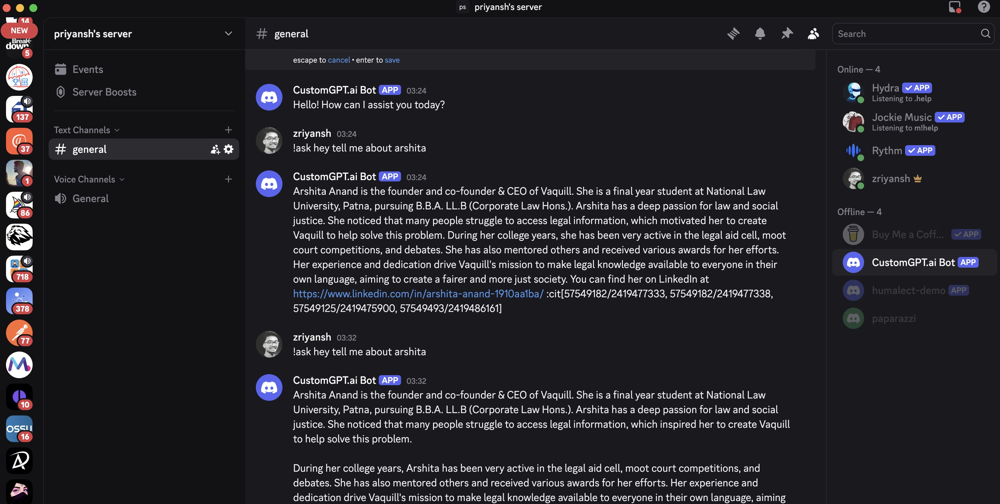
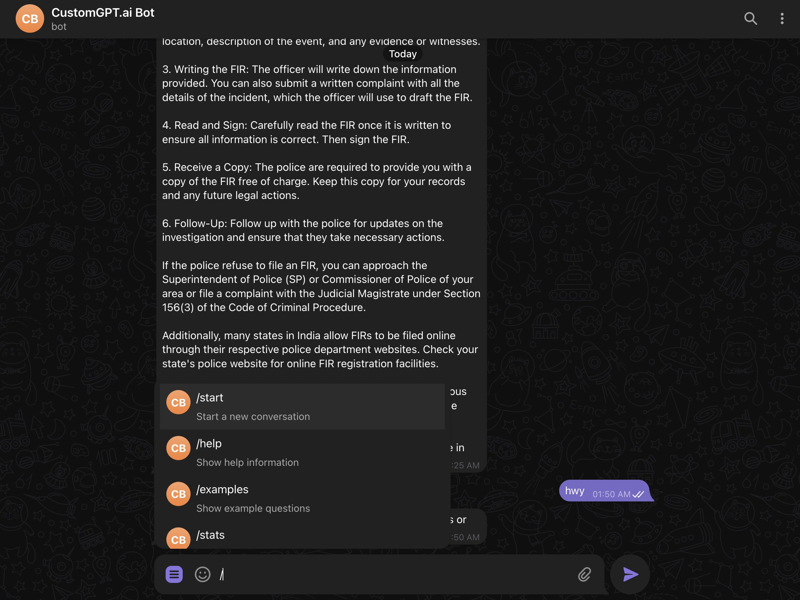

# CustomGPT Integrations (beta)

A collection of chatbot integrations for CustomGPT, allowing you to deploy AI-powered bots across multiple platforms using your CustomGPT agent's knowledge base.

---

## 1. Available Integrations

### 1.1 WhatsApp Bot

Integrate CustomGPT with WhatsApp using Twilio's WhatsApp Business API.

* **Features**: Rich media support, rate limiting, session management, starter questions
* **Setup Time**: 15-30 minutes
* **Hosting Options**: Railway, Render, Fly.io, Google Apps Script
* **[Full Documentation](Whatsapp-Bot/README.md)**

---

### 1.2 Discord Bot

A powerful Discord bot that brings CustomGPT's intelligence to your Discord servers.

* **Features**: Slash commands, conversation memory, interactive UI, source citations
* **Setup Time**: 10-20 minutes
* **Hosting Options**: Railway, Fly.io, Docker, Replit
* **[Full Documentation](Discord-Bot/README.md)**

---

### 1.3 Slack Bot

Enterprise-ready Slack integration with multi-agent support and advanced features.

* **Features**: Multi-agent support, thread conversations, rate limiting, analytics
* **Setup Time**: 20-30 minutes
* **Hosting Options**: Google Apps Script, Railway, Docker, Kubernetes
* **[Full Documentation](Slack-Bot/README.md)**

---

### 1.4 Telegram Bot

Fast and reliable Telegram bot with polling and webhook support.

* **Features**: Inline keyboards, conversation management, usage statistics, SSL support
* **Setup Time**: 10-15 minutes
* **Hosting Options**: Replit, Vercel, Railway, any VPS
* **[Full Documentation](Telegram-Bot/README.md)**

---

### 1.5 Google Chat Bot

Native Google Workspace integration for enterprise environments.

* **Features**: Direct messages, space conversations, multi-agent support
* **Setup Time**: 15-20 minutes
* **Hosting**: Google Apps Script (free)
* **[Full Documentation](Google%20Chat-Bot/README.md)**

---

### 1.6 Facebook Messenger Bot (Work in Progress)

Connect CustomGPT with Facebook Messenger for seamless customer interactions.

* **Status**: 🚧 Currently under development
* **Features**: Quick replies, persistent menu, typing indicators, media support
* **Setup Time**: 20-30 minutes (estimated)
* **Hosting Options**: Vercel, Google Apps Script, Node.js hosting
* **[Full Documentation](Facebook%20Messenger-Bot/README.md)**

---

## 2. Quick Start

1. **Choose Your Platform**: Select the messaging platform you want to integrate with.
2. **Get CustomGPT Credentials**:

   * Sign up at [CustomGPT.ai](https://customgpt.ai)
   * Create an agent/project
   * Get your API key and Project ID
3. **Follow Platform Guide**: Each integration has detailed setup instructions.
4. **Deploy**: Multiple free hosting options available for each platform.

---

## 3. Prerequisites

### 3.1 Required for All Integrations

* CustomGPT account with API access
* API Key and Project/Agent ID
* Basic command line knowledge

### 3.2 Platform-Specific Requirements

* **WhatsApp**: Twilio account (free trial available)
* **Discord**: Discord bot token and server
* **Slack**: Slack workspace with admin access
* **Telegram**: Telegram Bot Father token
* **Google Chat**: Google Workspace account
* **Facebook Messenger**: Facebook Page and App (developer account)

---

## 4. Feature Comparison

| Feature          | WhatsApp | Discord | Slack  | Telegram | Google Chat | FB Messenger |
| ---------------- | -------- | ------- | ------ | -------- | ----------- | ------------ |
| Free Hosting     | ✔        | ✔       | ✔      | ✔        | ✔           | 🚧 WIP       |
| Rate Limiting    | ✔        | ✔       | ✔      | ✔        | ✔           | 🚧 WIP       |
| Multi-Agent      | ✖        | ✖       | ✔      | ✖        | ✔           | 🚧 WIP       |
| Rich Media       | ✔        | ✔       | ✔      | ✔        | Limited     | 🚧 WIP       |
| Threading        | ✖        | ✔       | ✔      | ✖        | ✔           | 🚧 WIP       |
| Analytics        | ✔        | ✖       | ✔      | ✔        | ✖           | 🚧 WIP       |
| Setup Complexity | Medium   | Easy    | Medium | Easy     | Easy        | 🚧 WIP       |

---

## 5. Common Features

All integrations include:

* ✔ Conversation context management
* ✔ Rate limiting to prevent abuse
* ✔ Error handling and logging
* ✔ Configurable responses
* ✔ Security features (input validation, authentication)
* ✔ Docker support (where applicable)

---

## 6. Deployment Options

### 6.1 Free Hosting Platforms

* **Google Apps Script**: Best for Slack and Google Chat (always free)
* **Railway**: \$5 free credit/month, easy GitHub integration
* **Render**: 750 free hours/month, automatic deploys
* **Fly.io**: 3 free VMs, global deployment
* **Replit**: Good for Telegram bots, built-in hosting
* **Vercel**: Serverless functions for webhooks

### 6.2 Self-Hosting

* Docker containers available for most integrations
* SystemD service files for VPS deployment
* Detailed deployment guides in each bot's folder

---

## 7. Documentation Structure

Each integration includes:

* `README.md` - Setup and usage instructions
* `DEPLOYMENT.md` - Detailed hosting guides
* `CLAUDE.md` - Technical documentation for developers
* `.env.example` - Required environment variables
* Platform-specific deployment files (Dockerfile, etc.)

---

## 8. Contributing

Contributions are welcome! Please:

1. Fork the repository
2. Create a feature branch
3. Follow existing code patterns
4. Add documentation
5. Submit a pull request

---

## 9. Security Best Practices

* Never commit `.env` files or API keys
* Use environment variables for all secrets
* Implement rate limiting on all bots
* Validate and sanitize user inputs
* Keep dependencies updated
* Use HTTPS/SSL for webhooks

---

## 10. Support

* **CustomGPT Issues**: Check [CustomGPT docs](https://docs.customgpt.ai)
* **Integration Issues**: Open an issue in this repository
* **Platform-Specific Help**: Refer to platform documentation

---

## 11. License

MIT License

